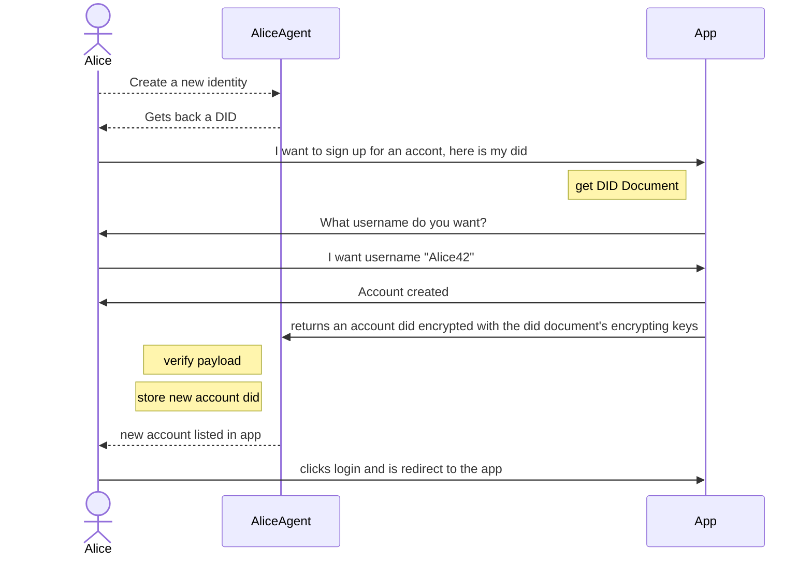

# jlinx Hypercore Spec

## Keys

### Creating a new hypercore identity

### when you can hypercore

- signing keys and hypercore keys can be the same

0. create a signing key pair on your machine
0. store the secret in a key vault
0. create your did document
  - did = `did:jlinx:${publicKey}`
  - any encrypting keys you want
0. append the first block to your hypercore microledger

### when you need a hypercore proxy

- signing keys and hypercore keys are different
- signing keys are held by your device
- hypercore keys are held by the proxy server
  - you cannot move proxy servers without superseeding your identity

1. create at least one signing key pair on your machine
2. store the secret in a key vault 
3. ask a jlinx did server to host a DID for you by posting a signed did document to it
4. server verfies the signature, creates its own hypercore keypair
  - HTTP post containing  
    - your did document as JSON string
      - *requires at least one signing key*  
    - signature of the JSON string  
  - server then
    - creates own signing keys
    - stores secret key
    - adds the did to the did docment
    - appends first message to micro-ledger
    - return the did = `did:jlinx:${hypercorePublicKey}`

### Signing a claim that you exist

- includes your did
- signed by your idenity keys

## JLINX Events

Every did is a micro-ledger of ordered events. 

### Claim you exist

Claiming you exist is the first step to others being able to make claims about you.

you must create unique crypto keys capable of signing strings

### Signup

signign up with jlinx is the same as Oauth in-that most apps dont need this link to make you an account
so you could link one or more later.

For single-sign-on to work we need either/both a web app to redirect to or a native app that handles jlinx://??? schema links

Maybe we can do this with browser plugins?

1. Alice visits example.com
2. Alice clicks "login with your own identity" === jlinx://${did for example.com}/login
3. Alice's JLINX Agent app launches to handle the link
4. Alice see's a new account listed in her app with a login button
5. Alice is logged in

**we should do the thing where the originial page gets logged in once you touch the app**

1. Alice visits example.com
2. Alice clicks signup
3. Alice is prompted from a list of signup methods
4. Alice chooses "Signup with a DID"
5. Alice is prompted for her DID
6. Alice posts her did to the server via a form
7. example.com resolves her did document
8. ??? alice needs to sign something to prove this DID is hers ???
   Ideally we would send the user to an app either via an http redirect to a web app or a custom url scheme jlinx://?????

This presuposes that the app has already declaired a did

1. an app claims to exist
2. an actor claims to exist
3. the actor does a signup ritual providing a DID
4. The app gets the did document and verifies its legit and has all the needed keys  
4.1. the app could render a page asking for username, credit card, or whatever is required
5. The app creates a local user account and associates it with the user's given DID
6. The user is logged in

